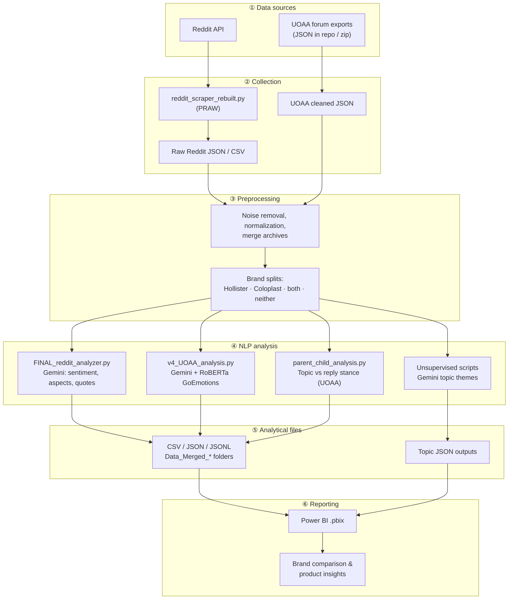
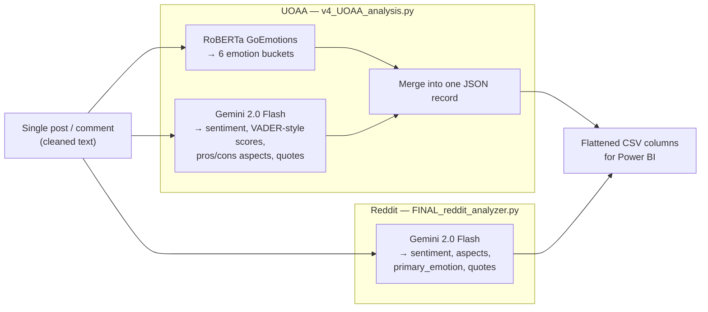

# AI-Based Patient Feedback Analytics for Ostomy Product Insights

**Author:** Sujith Thota  
**Time period analyzed:** 2016–2025 patient discussions  
**Brands:** Hollister and Coloplast (ostomy care)

---

## Live dashboard

**View the interactive insights dashboard:** [https://zesty-dodol-8a6073.netlify.app](https://zesty-dodol-8a6073.netlify.app)

The [**Patient Feedback Intelligence Dashboard**](https://zesty-dodol-8a6073.netlify.app) is a static, stakeholder-friendly web UI built from this project’s NLP outputs. It presents Hollister vs Coloplast insights without running Python locally—including:

- Sentiment **by brand and platform** (Reddit and UOAA, labeled separately)
- Hollister and Coloplast brand profiles and head-to-head comparison
- Platform differences, product attribute impact, emotions, themes, and actionable opportunities
- Selected Power BI / presentation visuals

Source code for the dashboard lives in [`dashboard/`](dashboard/) (`index.html`, `styles.css`, `script.js`). To run it locally, open `dashboard/index.html` in a browser or serve that folder with any static file server.

> The dashboard is a **read-only visualization layer** on top of offline analysis. The NLP pipeline (scraping, Gemini, RoBERTa) still runs locally via the Python scripts described below—not through the Netlify site.

---

## 1. Project Overview

This project turns scattered patient conversations into structured, decision-ready insights about **Hollister** and **Coloplast** ostomy products. It analyzes discussions from **Reddit** and the **United Ostomy Associations of America (UOAA)** forum—two places where patients share real experiences about leakage, adhesives, skin comfort, fit, odor control, and daily reliability.

The core work is an **end-to-end batch analytics and research pipeline** (Python scripts, JSON/CSV, Power BI). There is no live API or backend for re-running analysis in the browser. The pipeline:

1. Collects or loads patient text (Reddit via API; UOAA from exported forum datasets in this repo).
2. Cleans and structures data as JSON/CSV.
3. Runs **Google Gemini** for sentiment, product-attribute (pros/cons) extraction, quotes, and unsupervised topic discovery.
4. Runs **RoBERTa (GoEmotions)** for emotion signals on the primary UOAA analyzer.
5. Produces analytical files for **Power BI** dashboards used in stakeholder reporting.

The outcome is a repeatable way to measure patient perception, compare brands, and connect sentiment to **specific product experiences**—not just positive/negative labels.

---

## 2. Business Problem

Patient feedback about ostomy products does not sit in one place. It is spread across Reddit threads, UOAA topics, and long comment chains. Manual review is slow, inconsistent, and hard to scale across thousands of posts spanning many years.

Hollister needs a clearer picture of:

- How patients talk about its products **compared to Coloplast**
- Which product attributes drive satisfaction or frustration
- Whether perception is shifting over time (useful for pre/post product launch benchmarking)

This pipeline addresses that gap by converting unstructured patient language into **quantified sentiment**, **emotion context**, **recurring themes**, and **attribute-level drivers** that product, marketing, and patient-support teams can act on.

---

## 3. Project Objectives

| Objective | How it is addressed in this repo |
|-----------|----------------------------------|
| Scrape and collect patient discussions | Reddit: `reddit_scraper_rebuilt.py` (PRAW). UOAA: analyzed from exported JSON in `UOAA_Analysis/` |
| Clean and prepare unstructured text | Cleaned/merged JSON & CSV under `Reddit_Analysis/` and UOAA exports |
| Identify brand mentions | Brand-tagged datasets (`Data_Merged_Hollister`, `Data_Merged_Coloplast`, both, neither) |
| Perform sentiment analysis | Gemini prompts in `FINAL_reddit_analyzer.py`, `v4_UOAA_analysis.py` |
| Detect emotions | RoBERTa GoEmotions in `v4_UOAA_analysis.py` (UOAA); Gemini also returns a primary emotion label |
| Extract product attributes linked to sentiment | Structured `pros_aspects` / `cons_aspects` in Gemini JSON outputs |
| Topic modeling / theme discovery | `Reddit_Unsupervised_Analyzer.py`, `UOAA Unsupervised.py` + JSON topic outputs |
| Compare Hollister vs Coloplast | Merged brand datasets + comparative slides/Power BI reports |
| Communicate insights visually | `Reddit_BI_Visualizations/` and `UOAA_BI_Visualizations/` (`.pbix`) |
| Share insights in a web dashboard | [`dashboard/`](dashboard/) — deployed at [Netlify](https://zesty-dodol-8a6073.netlify.app) |

---

## 4. End-to-End Pipeline

### 1. Data Collection

- **Reddit:** Collected with **PRAW** (`Reddit_Analysis/Reddit_Scraper+Results/reddit_scraper_rebuilt.py`) from ostomy-related subreddits (e.g. `ostomy`, `OstomyCare`, `Crohns`, `UlcerativeColitis`, and related communities). Outputs timestamped JSON/CSV under `outputs/run_*`.
- **UOAA:** Forum discussions are provided as **exported structured JSON** in the repository (and in `2025 UOAA Final Deliverables.zip`). There is no UOAA scraper script in this repo; analysis runs on prepared exports.
- **Content:** Posts, comments, thread metadata, brand mentions, dates, and patient narratives about product use.

### 2. Data Cleaning and Preprocessing

- Removed noise (URLs, emojis where applicable), normalized whitespace, and standardized fields for NLP.
- Consolidated multi-source Reddit archives into cleaned JSON (e.g. `Reddit_Analysis/Cleaned_Reddit_Posts/`, `Reddit_Cleaned+Merged_Archives/`).
- Split or tagged records by brand visibility: **Hollister-only**, **Coloplast-only**, **both brands**, or **neither/other** (`Reddit_Analysis/Analyzed_&_Filtered_Data/Data_Merged_*`).
- Prepared text fields (`body`, `text`, `title`) for model input.

### 3. Sentiment Analysis

- **Google Gemini** classifies each post into **positive**, **negative**, or **neutral** (semantic-first rules in the prompt).
- Models also return **VADER-style** `neg` / `neu` / `pos` / `compound` scores so intensity can be compared over time.
- Outputs are stored per record in JSON and flattened into CSV columns such as `gemini.analysis.overall_sentiment` (see `merged_all_cleaned__hollister_only.csv`).

### 4. Emotion Analysis

- **UOAA (canonical):** `v4_UOAA_analysis.py` loads **`SamLowe/roberta-base-go_emotions`** via Hugging Face Transformers, collapses labels into six buckets (joy, sadness, anger, fear, disgust, neutral), and stores `roberta_emotions` alongside Gemini output.
- **Reddit:** The main Reddit analyzer (`FINAL_reddit_analyzer.py`) uses **Gemini-only** for `primary_emotion`; RoBERTa is not wired into that script today.
- **Why it matters:** Sentiment alone does not explain *how* patients feel. The same negative sentiment can reflect **frustration** (leaks, adhesive failure) or **concern** (skin damage), which matters for product prioritization.

### 5. Product Attribute Extraction

Gemini maps text to controlled aspect lists—for example:

| UOAA (`v4_UOAA_analysis.py`) | Reddit (`FINAL_reddit_analyzer.py`) |
|-------------------------------|-------------------------------------|
| `skin_tolerance`, `adhesion_reliability`, `filter_effectiveness`, … | `product_range`, `customer_support`, `adhesive_issues`, `skin_irritation`, … |

This step ties sentiment to **actionable product dimensions**: leakage, adhesive performance, skin irritation, comfort, fit, wear time, odor control, pouch usability, and support.

### 6. Topic Modeling / Theme Discovery

- Implemented as **Gemini-based unsupervised topic discovery** (not classical LDA in code).
- Scripts sample up to 1,000 posts, send combined text to Gemini, and return `positive_topics` / `negative_topics` with keywords and summaries.
- Example output: `Reddit_Analysis/Analyzed_&_Filtered_Data/Topic_Modeling_Code&Output/Ostomy_submissions_Hollister_Unsupervised_Topics_2025-11-10.json`.

### 7. Comparative Brand Analysis

- Hollister and Coloplast are compared on sentiment mix, emotions, topics, and attribute-level pros/cons.
- **Parent–child analysis** (`Parent_child_analysis/parent_child_analysis.py`) adds topic-level stance (agree/disagree) between original posts and replies on UOAA.
- **Dual-brand posts** can be analyzed with `Analysing_dual_branded_data/coloplast_hollister_analysis.py`.

### 8. Visualization and Dashboarding

- Analyzed CSV/JSON feeds **Power BI** reports in `Reddit_BI_Visualizations/` and `UOAA_BI_Visualizations/`.
- Dashboards cover sentiment trends, brand comparison, topic/emotion breakdowns, and attribute-level pain points.
- Detailed charts are in Power BI (`.pbix`) and `Presentation_slides/AI-based-Analytics Presentation.pptx`; this README uses **Mermaid diagrams and tables** for GitHub-friendly rendering.

---

## 5. Architecture Overview

```
Raw Patient Discussions
        ↓
Reddit Scraper (PRAW) / UOAA Forum Exports (JSON)
        ↓
Data Cleaning and Preprocessing
        ↓
Brand Filtering and Structured Dataset Creation
        ↓
Gemini Sentiment + Aspect Analysis (+ quotes)
        ↓
RoBERTa Emotion Analysis (UOAA v4 analyzer)
        ↓
Gemini Unsupervised Topic Discovery
        ↓
CSV / JSON Analytical Outputs
        ↓
Power BI Dashboards (.pbix)
        ↓
Business Insights and Brand Comparison
```

**Design notes**

- **No** live frontend, backend API, SQL database, or vector database.
- **Offline** batch pipeline: run Python scripts locally, refresh data files, open Power BI Desktop.
- **APIs used:** Reddit API (scraping), Google Gemini API (NLP). Models are called per post (supervised) or on sampled batches (topics).

### System architecture (end-to-end)

The diagram below reflects the **actual repository layout**: separate ingestion paths for Reddit and UOAA, shared preprocessing and brand tagging, parallel NLP jobs, and Power BI as the reporting layer.



### Per-post NLP flow (UOAA vs Reddit)



### Five-stage business view

| Stage | What happens | Repository location |
|-------|----------------|---------------------|
| 1. Data collection | Reddit scrape or load UOAA exports | `Reddit_Scraper+Results/`, `UOAA_Analysis/` |
| 2. Preprocessing | Clean, merge, brand-tag | `Cleaned_Reddit_Posts/`, `Reddit_Cleaned+Merged_Archives/` |
| 3. NLP | Gemini (+ RoBERTa on UOAA) per post; batch topics | `Analyzer/`, `v4_UOAA_analysis.py`, `Topic_Modeling_Code&Output/` |
| 4. Comparative analysis | Hollister vs Coloplast splits | `Data_Merged_Hollister/`, `Data_Merged_Coloplast/` |
| 5. Visualization | Dashboards for stakeholders | `*_BI_Visualizations/*.pbix` |

> **Note:** Decorative slide graphics with dark backgrounds are **not** embedded here—they do not render well on GitHub dark mode. Use the Mermaid diagrams and tables below; full charts remain in `Presentation_slides/AI-based-Analytics Presentation.pptx`.

---

## 6. Technical Stack

| Category | Tools / Technologies | Purpose |
|----------|----------------------|---------|
| Programming | Python 3 | Data processing and NLP pipeline |
| Data collection | PRAW, Reddit API | Reddit scraping (`reddit_scraper_rebuilt.py`) |
| Data handling | JSON, CSV, pandas | Storage, merging, unsupervised sampling |
| LLM analysis | Google Gemini (`google.generativeai`, `google.genai`) | Sentiment, aspects, quotes, topics, stance |
| Emotion analysis | RoBERTa GoEmotions (`transformers`, `SamLowe/roberta-base-go_emotions`) | Emotion buckets on UOAA v4 pipeline |
| Sentiment scoring support | VADER-style fields via Gemini; optional `vaderSentiment` in v4 | Intensity scores aligned with VADER conventions |
| Topic modeling | Gemini unsupervised scripts | Recurring positive/negative themes |
| Visualization | Power BI (`.pbix`) | Interactive dashboards for stakeholders |
| Configuration | `python-dotenv`, `.env` | API keys for Gemini and Reddit |

**Not used in this repository:** FastAPI, React, SQL/NoSQL databases, vector DBs, PySpark, Docker/Kubernetes deployment, or Jupyter notebooks (despite being mentioned in early drafts elsewhere).

**Implementation note:** README and slides sometimes refer to “Vertex AI” or “Gemini 2.5.” In code, analyzers primarily use the **Google Generative AI SDK** with models such as **`gemini-2.0-flash`** (v4, Reddit) and **`gemini-2.5-flash`** (unsupervised topic scripts).

---

## 7. Repository Structure

```
AI-Based-Consumer-Insights-Analytics-using-LLMs-and-NLP/
├── README.md                          # This file
├── requirements.txt                   # Python dependencies
├── .env.example                       # API key template
├── dashboard/                         # ★ Static insights UI (HTML/CSS/JS, Chart.js)
│   ├── index.html                     # Open locally or deploy (e.g. Netlify)
│   ├── styles.css
│   ├── script.js
│   └── assets/images/                 # Presentation / BI screenshots
├── docs/images/                       # Optional slide exports (legacy; README uses Mermaid + tables)
├── Presentation_slides/               # Full slide deck (.pptx)
│
├── Reddit_Analysis/                     # Reddit scrape, clean, analyze (~119 MB)
│   ├── Reddit_Scraper+Results/        # PRAW scraper + raw scrape samples
│   ├── Cleaned_Reddit_Posts/          # Per-source cleaned JSON by brand
│   ├── Reddit_Cleaned+Merged_Archives/# Merged Hollister/Coloplast/unbranded
│   ├── Archived_Reddit_Posts/         # Historical .jsonl archives
│   └── Analyzed_&_Filtered_Data/
│       ├── Analyzer/                  # FINAL_reddit_analyzer.py, prompts
│       ├── Topic_Modeling_Code&Output/# Unsupervised topics + JSON outputs
│       ├── Data_Merged_Hollister/     # Analyzed Hollister CSV/JSON
│       ├── Data_Merged_Coloplast/     # Analyzed Coloplast CSV/JSON
│       ├── Data_Merged_Both_Orgs/     # Dual-brand mentions
│       ├── Data_Merged_neither-other_orgs/
│       └── ALL_Data_Merged/           # Combined cleaned + analyzed sets
│
├── UOAA_Analysis/                     # UOAA NLP scripts + results (~45 MB)
│   ├── UOAA_Python_Code/
│   │   ├── v4_UOAA_analysis.py        # ★ Canonical UOAA analyzer (Gemini + RoBERTa)
│   │   ├── v3_UOAA_analysis.py        # Earlier version (superseded by v4)
│   │   ├── Parent_child_analysis/     # Topic/post stance + aggregation CSV
│   │   ├── Analysing_dual_branded_data/
│   │   └── UOAA Unsupervised.py       # Gemini topic discovery
│   ├── 2025 UOAA Final Deliverables.zip
│   └── UOAA_code_POC/uoaa.zip
│
├── Reddit_BI_Visualizations/          # Power BI reports for Reddit insights
├── UOAA_BI_Visualizations/            # Power BI reports for UOAA insights
```

### Canonical scripts (recommended entry points)

| Task | Script |
|------|--------|
| Scrape Reddit | `Reddit_Analysis/Reddit_Scraper+Results/reddit_scraper_rebuilt.py` |
| Analyze Reddit posts | `Reddit_Analysis/Analyzed_&_Filtered_Data/Analyzer/FINAL_reddit_analyzer.py` |
| Analyze UOAA posts | `UOAA_Analysis/UOAA_Python_Code/v4_UOAA_analysis.py` |
| UOAA topic/post stance | `UOAA_Analysis/UOAA_Python_Code/Parent_child_analysis/parent_child_analysis.py` |
| Unsupervised topics | `Reddit_Analysis/.../Reddit_Unsupervised_Analyzer.py` or `UOAA_Analysis/.../UOAA Unsupervised.py` |

---

## 8. Key Analysis Performed

### Sentiment Analysis

Each patient text is classified as **positive**, **negative**, or **neutral** using Gemini with strict JSON schema and anti-hallucination rules (brands and product claims must appear in text). VADER-style numeric scores (`neg`, `neu`, `pos`, `compound`) support trend charts and intensity comparisons in Power BI.

This answers: *“How do patients feel about this brand or experience?”*

### Emotion Analysis

RoBERTa (GoEmotions) on UOAA adds a layer beyond polarity—e.g. **joy** when a product “finally works,” **anger** during adhesive failure, **sadness** around complications, or **neutral** informational posts.

**GoEmotions → six buckets** (`v4_UOAA_analysis.py`):

| Emotion bucket | Example GoEmotions labels grouped in code |
|----------------|-------------------------------------------|
| **joy** | joy, amusement, gratitude, relief, optimism, pride, … |
| **sadness** | sadness, disappointment, grief, remorse |
| **anger** | anger, annoyance, disapproval |
| **fear** | fear, nervousness |
| **disgust** | disgust, embarrassment |
| **neutral** | neutral, confusion, curiosity, surprise, … |

**VADER-style sentiment scores** (from Gemini output, aligned with presentation methodology):

| Field | Range | Meaning |
|-------|-------|---------|
| `neg` | 0–1 | Share of negative polarity in text |
| `neu` | 0–1 | Share of neutral polarity |
| `pos` | 0–1 | Share of positive polarity |
| `compound` | −1 to +1 | Overall polarity (negative ← 0 → positive) |
| `overall_sentiment` | positive / negative / neutral | Semantic label (meaning-first, not score-only) |

**Insight:** Sentiment tells *direction*; emotion explains the patient’s *reaction* and helps prioritize fixes (leak **frustration** vs. mild dissatisfaction).

### Attribute-Level Analysis

Pros and cons are constrained to predefined aspect lists so outputs aggregate cleanly in BI tools. Negative sentiment often clusters around **adhesive issues**, **leakage/seal failure**, **skin irritation**, and **pouch functionality**; positive sentiment around **reliability**, **wear time**, **comfort**, **odor control**, and **support**.

This is one of the most actionable parts of the project: it links scores to **product features**, not just brand names.

### Topic Modeling

Gemini summarizes large samples into named themes with keywords—for example Hollister positive topics such as **customer support/samples**, **extended wear adhesion**, and **odor control (M9 drops)**; negative topics such as **leakage and seal issues** (see topic JSON in `Topic_Modeling_Code&Output/`).

**Insight:** Thousands of posts collapse into a reviewable set of themes for clinical, product, and marketing stakeholders.

### Brand Comparison

Compared Hollister vs Coloplast on:

- Sentiment distribution (positive / neutral / negative share)
- Platform differences (UOAA vs Reddit tone)
- Top positive and negative aspects
- Emotion mix by product category (bags, wafers, accessories)

Presentation sample sizes (branded posts used in comparative charts):

| Platform | Hollister (n) | Coloplast (n) |
|----------|---------------|---------------|
| UOAA | 645 | 420 |
| Reddit | 1,245 | 1,334 |

*Repository merged CSVs can be larger (e.g. 5,294 Hollister / 4,223 Coloplast rows in `merged_all_cleaned__*_only.csv`) because they include broader mention-level records—not only the strict branded subset used in some slides.*

---

## 9. Key Insights (Tables)

Insights below are taken from the project **presentation** and **Power BI analysis** (branded post subsets). They are formatted as tables so they stay readable on GitHub light and dark themes. Interactive charts live in `.pbix` files and `Presentation_slides/AI-based-Analytics Presentation.pptx`.

### Sample sizes (branded posts in comparative analysis)

| Platform | Hollister (n) | Coloplast (n) |
|----------|-----------------|---------------|
| **UOAA** | 645 | 420 |
| **Reddit** | 1,245 | 1,334 |

### Reddit — sentiment share by brand

| Brand | Positive | Neutral | Negative |
|-------|----------|---------|----------|
| **Hollister** (n=1,245) | 50.53% | 26.12% | 23.35% |
| **Coloplast** (n=1,334) | 56.52% | 26.84% | 16.64% |

**Insight:** On Reddit, Coloplast has a **higher positive share** and a **lower negative share** in this branded subset. Hollister carries more negative discussion relative to Coloplast.

### Cross-platform sentiment differences (Coloplast vs Hollister)

| Platform | Positive (Δ) | Negative (Δ) | Interpretation |
|----------|--------------|--------------|----------------|
| **UOAA** | +5.7 pts | +4.7 pts | Coloplast is **more polarizing**—more positive *and* more negative |
| **Reddit** | +6.0 pts | −9.5 pts | Coloplast is **net-favored**—higher positive, notably lower negative |

### Hollister vs Coloplast — qualitative comparison (Reddit branded subset)

| Dimension | Hollister (n=1,245) | Coloplast (n=1,334) |
|-----------|------------------------|----------------------|
| **Top positive driver** | Product performance & reliability | Leak prevention / good seal |
| **Top negative driver** | Adhesive / barrier problems | Leaks & blowouts |
| **Skin health** | Mixed; irritation often tied to adhesive / rings | Strong skin protection narrative; lower irritation mentions |
| **Usability** | Good pouch usability | Ease of use / convenience cited often |
| **Durability** | Barrier ring degradation; pouch detachment | Pouch durability concerns |
| **Fit / seal** | Generally good seal; activity-related leaks | Generally good seal; isolated blowouts |
| **Emotion pattern** | Joy + neutral dominate; anger lower | Joy + neutral dominate; slightly more negative emotion signal |
| **Positive sentiment share** | 50.53% (see table above) | 56.52% (see table above) |

### Hollister — top themes by platform (presentation)

| Platform | Top positive themes | Top negative themes |
|----------|---------------------|---------------------|
| **UOAA** | System security, skin tolerance, reliable wear | **Adhesive failure** (dominant complaint) |
| **Reddit** | Product range, customer support | **Adhesive issues**, **skin irritation** |

### Hollister — sentiment by product category (UOAA)

| Product area | Pattern (UOAA, Hollister) |
|--------------|---------------------------|
| **Overall** | Mostly positive or neutral |
| **Bags / pouches** | Large share of **negative** responses |
| **Skin barriers / wafers** | Large share of **negative** responses |
| **Accessories** | Negative emotion concentrated here |

### Hollister — emotion by product category (UOAA)

| Emotion | Pattern |
|---------|---------|
| **Joy, neutral** | Dominant across discussions |
| **Sadness, anger** | Concentrated in bags/pouches, wafers, accessories |

### Trends over time (2016–2025)

| Platform | Trend |
|----------|--------|
| **UOAA (Hollister)** | Sentiment largely **stable**; negative share stays relatively low |
| **Reddit (Hollister)** | **Positive sentiment increases** over time; negative remains comparatively low |

### Unsupervised topic examples (from repo JSON)

| Sentiment | Example Hollister theme (Reddit topic output) |
|-----------|-----------------------------------------------|
| Positive | Customer support & samples; extended-wear adhesion; M9 odor control |
| Negative | Leakage & seal issues; short wear time with thin output |

Source: `Topic_Modeling_Code&Output/Ostomy_submissions_Hollister_Unsupervised_Topics_2025-11-10.json`

### Power BI — what stakeholders see

| Dashboard focus | Examples in repo |
|-----------------|------------------|
| Sentiment overview & trends | `Hollister_analysis_UOAA.pbix`, `Copy of FINAL HOLLISTER.pbix` |
| Brand comparison | `coloplast_hollister_combined_analysis-2.pbix`, Reddit comparison pages |
| Emotion & product category | UOAA emotion / distribution pages |
| Parent topic stance (agree/disagree) | `coloplast_parent_child_analysis.pbix` |
| Attribute / aspect drill-down | Pros & cons from Gemini columns in merged CSVs |

### Gemini prompt rules (summary)

| Rule | Purpose |
|------|---------|
| No hallucinated brands or products | Only text-supported facts |
| Strict JSON schema | Reliable CSV / Power BI import |
| VADER-style `neg` / `neu` / `pos` / `compound` | Quantitative trends |
| Controlled `pros_aspects` / `cons_aspects` lists | Comparable attribute reporting |
| Verbatim `key_quotes` | Qualitative evidence for stakeholders |

Full prompt text: `Reddit_Analysis/Analyzed_&_Filtered_Data/Analyzer/NEW# Gemini Prompt.txt`

---

## 10. Results and Insights

### What the pipeline delivered

- **Structured outputs** from raw patient text: every analyzed post can include sentiment, scores, aspects, emotions (UOAA), quotes, and metadata for BI.
- **Quantified brand perception** for Hollister and Coloplast on two distinct channels (supportive UOAA vs more varied Reddit).
- **Attribute-linked drivers** so teams see *why* sentiment is positive or negative—not just the label.

### Quantitative patterns (from presentation, branded subsets)

- **UOAA:** Coloplast shows about **+5.7 percentage points** higher positive sentiment and **+4.7 points** higher negative sentiment than Hollister—described as more **polarizing**.
- **Reddit:** Coloplast shows about **+6.0 points** higher positive and **~9.5 points** lower negative sentiment than Hollister in the same analysis.
- **Cross-platform:** Coloplast maintains a higher positive share on both channels; Hollister carries a **larger negative share on Reddit**.

### Qualitative patterns

**Strengths mentioned across platforms**

- **Hollister:** adhesion reliability, system stability, pouch usability, skin tolerance, familiarity.
- **Coloplast:** skin comfort, ease of use, seal performance, leak prevention.

**Pain points**

- Adhesive failure, leakage/seal issues, skin irritation, barrier comfort, filter limitations, pouch detachment (see negative topics in unsupervised JSON and aspect tags in analyzed CSVs).

**Emotional context**

- Discussions are often neutral-to-positive, but frustration and anger concentrate around **daily reliability problems** (leaks, wear time, skin damage).
- Relief and joy appear when patients find a workable fit, odor solution, or supportive supply experience.

### Topic modeling value

Unsupervised Gemini topics reduced large corpora into named themes—for example Hollister **extended wear adhesion** and **M9 odor control** as positives, and **leakage/seal issues** as a dominant negative theme—making forum noise navigable for product teams.

### Strategic takeaway (from presentation)

Hollister can build on **reliability and usability** while prioritizing innovation in **adhesive longevity**, **barrier resilience**, and **performance during movement**—areas repeatedly tied to negative sentiment and frustration in patient text.

---

## 11. Power BI Dashboard

Power BI is the stakeholder layer of this project. `.pbix` files connect to analyzed CSV/JSON produced by the Python pipeline.

| Report (examples) | Location |
|-------------------|----------|
| Hollister UOAA analysis | `UOAA_BI_Visualizations/Hollister_analysis_UOAA.pbix` |
| Coloplast / combined UOAA | `UOAA_BI_Visualizations/V4_Coloplast.pbix`, `coloplast_hollister_combined_analysis-2.pbix` |
| Parent–child stance views | `UOAA_BI_Visualizations/coloplast_parent_child_analysis.pbix`, `Hollister_parent_child_visualization-2.pbix` |
| Reddit Hollister / Coloplast | `Reddit_BI_Visualizations/Copy of FINAL HOLLISTER.pbix`, `Copy of Reddit_Coloplast_visuals.pbix` |

**Typical dashboard capabilities**

- Sentiment overview and trends over time  
- Hollister vs Coloplast comparison  
- Topic/theme and attribute breakdowns  
- Emotion distribution by product category  
- Identification of top negative and positive aspects  
- Exploration of patient quotes (where loaded into the model)  
- Agree/disagree stance patterns on UOAA (from parent–child CSV summaries)

**Opening locally:** Install [Power BI Desktop](https://powerbi.microsoft.com/desktop/), open a `.pbix` file, and **refresh data source paths** if files moved—connections are machine-specific.

| Report type | Typical pages / metrics |
|-------------|-------------------------|
| Sentiment overview | Positive / neutral / negative %, trends by year |
| Brand comparison | Hollister vs Coloplast side-by-side |
| Product categories | Bags, wafers, accessories — sentiment & emotion |
| Top aspects | Ranked pros/cons from Gemini aspect fields |
| Stance (UOAA) | Agree / disagree / mixed per topic thread |
| Quotes | Representative patient language (where modeled) |

---

## 12. How to Run the Project Locally

### View the insights dashboard (no Python required)

**Online:** [https://zesty-dodol-8a6073.netlify.app](https://zesty-dodol-8a6073.netlify.app)

**Local:**

```bash
cd dashboard
open index.html          # macOS
# Or: python3 -m http.server 8080  →  http://localhost:8080
```

Charts load from the Chart.js CDN; an internet connection is needed the first time.

### Run the NLP pipeline (Python)

#### Prerequisites

- Python 3.10+ recommended  
- Power BI Desktop (for dashboards only)  
- API keys: [Google AI Studio](https://aistudio.google.com/) (Gemini), [Reddit apps](https://www.reddit.com/prefs/apps) (PRAW)

### Setup

```bash
git clone <repository-url>
cd AI-Based-Consumer-Insights-Analytics-using-LLMs-and-NLP

python3 -m venv venv
source venv/bin/activate   # Windows: venv\Scripts\activate

pip install -r requirements.txt
cp .env.example .env
# Edit .env with your keys
```

### Environment variables

| Variable | Used by |
|----------|---------|
| `GEMINI_API_KEY` | `v4_UOAA_analysis.py`, `FINAL_reddit_analyzer.py`, unsupervised scripts |
| `GOOGLE_API_KEY` | `parent_child_analysis.py` (same key as Gemini in practice) |
| `REDDIT_CLIENT_ID`, `REDDIT_CLIENT_SECRET`, `REDDIT_USER_AGENT` | `reddit_scraper_rebuilt.py` |

### Run Reddit scraper (optional)

```bash
cd Reddit_Analysis/Reddit_Scraper+Results
python reddit_scraper_rebuilt.py \
  --subs "ostomy,Ostomy" \
  --limit 500 \
  --include-comments
```

Output: `outputs/run_<timestamp>/reddit_<scope>_<timestamp>.json`

### Run Reddit analyzer

```bash
cd Reddit_Analysis/Analyzed_&_Filtered_Data/Analyzer

python FINAL_reddit_analyzer.py \
  --input "../../Cleaned_Reddit_Posts/Ostomy_comments_Hollister_final.json" \
  --output "./hollister_gemini_results.json" \
  --max-posts 100
```

**Important:** `--max-posts` defaults to **50**. Pass a larger value (or modify the default) for full-corpus runs. Pre-analyzed CSVs already exist under `Data_Merged_Hollister/` and `Data_Merged_Coloplast/`.

### Run UOAA analyzer (canonical)

```bash
cd UOAA_Analysis/UOAA_Python_Code

python v4_UOAA_analysis.py \
  --input "/path/to/uoaa_hollister_cleaned.json" \
  --output "./uoaa_hollister_results.json" \
  --batch-size 200 \
  --workers 4
```

First run downloads the RoBERTa model from Hugging Face (~500MB+). Results are written as JSON and incremental JSONL.

Example result files already in repo:

- `uoaa_hollister_results (2).json` (1,210 records)  
- `uoaa_coloplast_results (2).json` (982 records)

### Run UOAA parent–child stance analysis

```bash
cd UOAA_Analysis/UOAA_Python_Code/Parent_child_analysis

export GOOGLE_API_KEY="your_key"
python parent_child_analysis.py \
  --input "/path/to/uoaa_topics_with_content.json"
```

Produces per-post JSON and topic summary CSV (examples: `uoaa_hollister_parent_child_results.csv`).

### Run unsupervised topic modeling

Edit the `FILE_PATH` at the top of:

- `Reddit_Analysis/Analyzed_&_Filtered_Data/Topic_Modeling_Code&Output/Reddit_Unsupervised_Analyzer.py`
- `UOAA_Analysis/UOAA_Python_Code/UOAA Unsupervised.py`

Then:

```bash
export GEMINI_API_KEY="your_key"
python Reddit_Unsupervised_Analyzer.py
```

### Open Power BI

Open any `.pbix` under `Reddit_BI_Visualizations/` or `UOAA_BI_Visualizations/` and point data sources to your local analyzed CSV paths.

---

## 13. Limitations

- **Batch/offline only** — not a deployed web app or real-time monitoring system.  
- **UOAA ingestion** — scraping/cleaning scripts for UOAA are not in-repo; analysis depends on exported JSON (e.g. inside deliverable zip files).  
- **Gemini cost and variability** — full re-runs over thousands of posts incur API cost; LLM topic summaries can shift slightly between runs.  
- **Reddit emotion gap** — RoBERTa is integrated on UOAA v4 but not on `FINAL_reddit_analyzer.py`.  
- **Hardcoded paths** — older scripts (`UOAA Analyzer.py`, unsupervised scripts) contain Windows paths; use v4/CLI args where possible.  
- **Power BI portability** — `.pbix` data connections may break on another machine until refreshed.  
- **Sample size definitions** — presentation n-counts (branded subsets) differ from full merged CSV row counts; document filters when publishing metrics.  
- **No automated tests** — quality relies on prompt design, schema validation, and manual BI review.

---

## 14. Future Improvements

- Standardize on **v4** + **FINAL_reddit_analyzer** and archive duplicate scripts (`v3`, `UOAA Analyzer.py`).  
- Add reproducible **merge/clean** Python modules for Reddit and UOAA (currently mostly artifact-driven).  
- Remove hardcoded paths; require `--input` / `--output` everywhere.  
- Add **RoBERTa emotion analysis to Reddit** for parity with slides.  
- LLM output **evaluation harness** (schema checks, spot samples, agreement stats).  
- **Automated report export** (PDF/HTML) from pipeline outputs.  
- Publish a **shared Power BI template** with relative data paths.  
- Optional lightweight **Streamlit** explorer for quotes and filters (not in scope today).

---

## 15. Final Summary

This repository demonstrates **end-to-end applied AI analytics** for patient voice: collecting community discussions, preparing unstructured text, applying **LLM-based sentiment and attribute extraction**, enriching UOAA data with **RoBERTa emotions**, discovering themes through **Gemini topic modeling**, comparing **Hollister and Coloplast** across platforms, and communicating findings through **Power BI** and a [**hosted insights dashboard**](https://zesty-dodol-8a6073.netlify.app). The Python pipeline is for research and batch analysis; the Netlify dashboard is a static, read-only view of key findings for recruiters, reviewers, and stakeholders.

For the full narrative and additional charts, see `Presentation_slides/AI-based-Analytics Presentation.pptx`.

---

## Related Files

| Resource | Path |
|----------|------|
| **Live dashboard** | [https://zesty-dodol-8a6073.netlify.app](https://zesty-dodol-8a6073.netlify.app) |
| Dashboard source | `dashboard/` |
| Slide deck | `Presentation_slides/AI-based-Analytics Presentation.pptx` |
| Architecture diagrams | Mermaid in this README (sections 5–9) |
| Legacy slide PNGs | `docs/images/` (optional; may not render on dark GitHub) |
| Gemini prompt (Reddit) | `Reddit_Analysis/Analyzed_&_Filtered_Data/Analyzer/NEW# Gemini Prompt.txt` |
| Analyzed Hollister CSV | `Reddit_Analysis/Analyzed_&_Filtered_Data/Data_Merged_Hollister/merged_all_cleaned__hollister_only.csv` |
| Topic output example | `Reddit_Analysis/Analyzed_&_Filtered_Data/Topic_Modeling_Code&Output/Ostomy_submissions_Hollister_Unsupervised_Topics_2025-11-10.json` |
